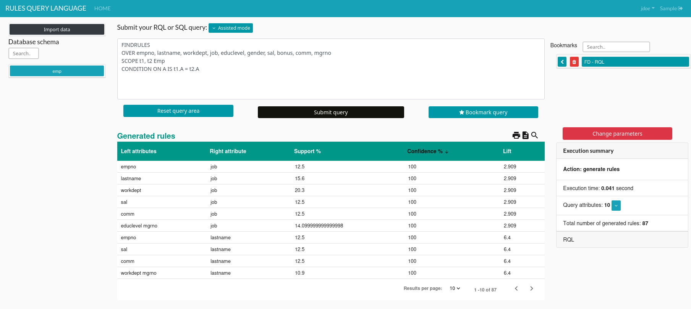

# RQL project

RQL (Rule Query Language) is a framework that allows the user to mine dependencies such as association rules, functional dependencies, order dependencies, etc.

This project includes a Web interface to write SQL or RQL queries on top of a local DBMS, and browse generated rules.

You can read more about RQL using the following resources:

- [RQL: A Query Language for Rule Discovery in Databases](https://hal.science/hal-01395083/), a TCS paper, 2017.
- [RQL: An SQL-like Query Language for Discovering Meaningful Rules](https://hal.science/hal-01301091/), an ICDM demo, 2014.
- [Query Rewriting for Rule Mining in Databases](https://hal.science/hal-01339257/), an LML workshop paper, 2013.
- [Armstrong-compliant Logical Query Languages](https://hal.science/hal-00649604/), an LID workshop paper, 2011.


## Software requirements

* [Docker](https://www.docker.com/) (that's all)

RQL building and deployment have been tested on:

* macOS Sonoma (with Docker Desktop),
* Ubuntu 20.04.6 LTS
* Debian 12.5

In fact, any operating system that supports [Docker](https://www.docker.com/) should be able to build RQL.

## Build

```console
$ docker compose build
```

## Run

* Create all containers

```console
$ docker compose up -d
```

* Initialize the database

```console
$ docker exec -i rql_db psql -U postgres < db_init.sql
```

* Open the http://localhost/rql URL with your favorite web browser.  
To log in, the default account has credentials admin/adminadmin.

## Example

The following example is based on a sample employee table. It can be created from the RQL main query form, which supports both SQL and RQL queries.

~~~SQL
CREATE TABLE emp (
  empno INT,
  lastname VARCHAR(20),
  workdept VARCHAR(3),
  job VARCHAR(20),
  educlevel INT,
  gender CHAR,
  sal INT,
  bonus INT,
  comm INT,
  mgrno INT
);
INSERT INTO EMP VALUES (10, 'SPEN', 'C01', 'FINANCE', 18, 'F', 52750, 500, 4220, 20);
INSERT INTO EMP VALUES (20, 'THOMP', NULL, 'MANAGER', 18, 'M', 41250, 800, 3300, NULL);
INSERT INTO EMP VALUES (30, 'KWAN', NULL, 'FINANCE', 20, 'F', 38250, 500, 3060, 10);
INSERT INTO EMP VALUES (50, 'GEYER', NULL, 'MANAGER', 16, 'M', 40175, 700, 3214, 20);
INSERT INTO EMP VALUES (60, 'STERN', 'D21', 'SALE', 14, 'M', 32250, 500, 2580, 30);
INSERT INTO EMP VALUES (70, 'PULASKI', 'D21', 'SALE', 16, 'F', 36170, 700, 2893, 100);
INSERT INTO EMP VALUES (90, 'HENDER', 'D21', 'SALE', 17, 'F', 29750, 500, 2380, 10);
INSERT INTO EMP VALUES (100, 'SPEN', 'C01', 'FINANCE', 18, 'M', 26150, 800, 2092, 20);
~~~

RQL can then be used to identify dependencies within the data. For instance, the following query identifies functional dependencies.

~~~RQL
FINDRULES
OVER empno, lastname, workdept, job, educlevel, gender, sal, bonus, comm, mgrno
SCOPE t1, t2 emp
CONDITION ON A IS t1.A = t2.A
~~~



## User accounts

New user accounts must be added manually.

```console
$ docker exec -i rql_db psql -U postgres -d rql
```

~~~SQL
INSERT INTO users (username, firstname, lastname, hashpassword, isadmin)
VALUES
('jdoe', 'Jane', 'Doe', '<bcrypt hashed password>', FALSE);
~~~

RQL uses the original version of bcrypt hashing with 12 rounds.
Therefore, hashed passwords should be of the form: `$2a$12$...`.

An example of such password is provided at the end of the `db_init.sql` file.

## Acknowledgments

RQL has been partially funded by:

- LIRIS, INSA Lyon and the French National Research Agency (ANR), as part of the DAG project
- CNRS, as part of the Mastodons PetaSky, QualiSky and QDoSSI projects
- LIAS, ISAE-ENSMA and the MIRES research federation

### Historic contributors

* Mickael Baron, LIAS, ISAE-ENSMA
* Nicolas Buisson, LIRIS, INSA Lyon
* Brice Chardin, LIAS, ISAE-ENSMA
* Emmanuel Coquery, LIRIS, Université Claude Bernard Lyon 1
* Benjamin Gouriou, LIMOS, ISIMA
* Marie Pailloux, LIMOS, ISIMA
* Jean-Marc Petit, LIRIS, INSA Lyon
* Bilal Rezkellah, LIAS, ISAE-ENSMA

## Citation

If you use RQL in a scientific publication, please reference the following work:

Chardin, B., Coquery, E., Pailloux, M., & Petit, J.-M. (2017). RQL: A Query Language for Rule Discovery in Databases. Theoretical Computer Science, 658, 357-374.

~~~bibtex
@article{rql2017,
  title={RQL: A Query Language for Rule Discovery in Databases},
  author={Chardin, Brice and Coquery, Emmanuel and Pailloux, Marie and Petit, Jean-Marc},
  journal={Theoretical Computer Science},
  volume={658},
  pages={357--374},
  year={2017},
  publisher={Elsevier},
}
~~~
